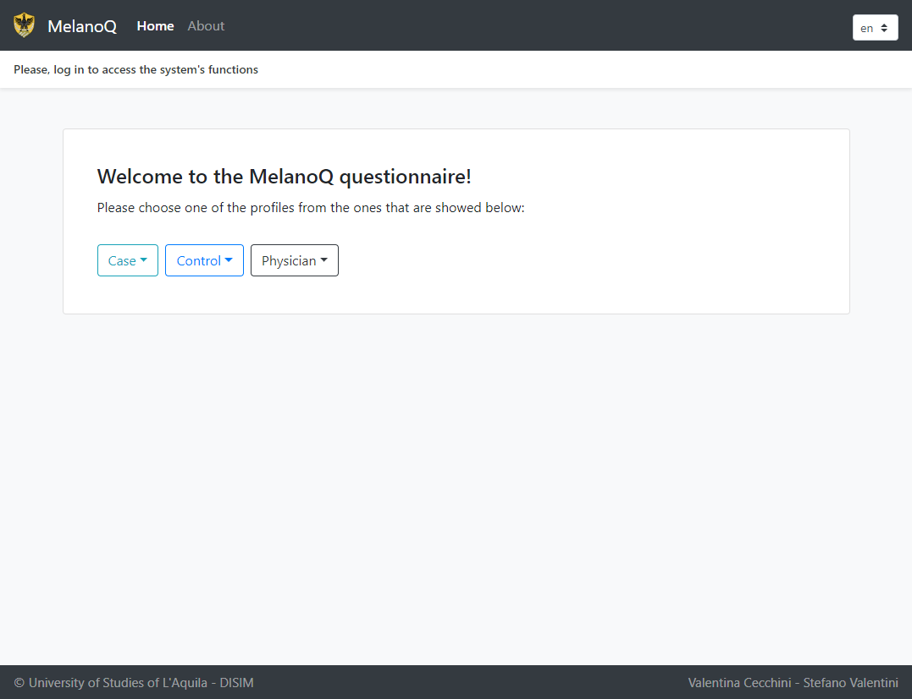
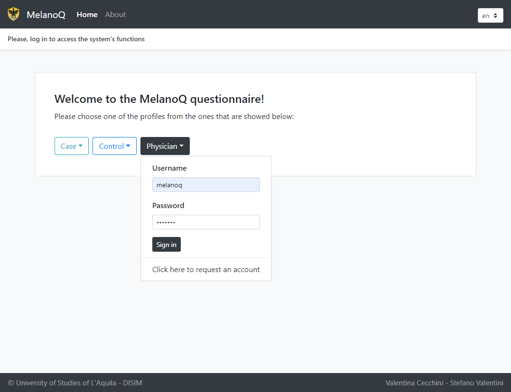
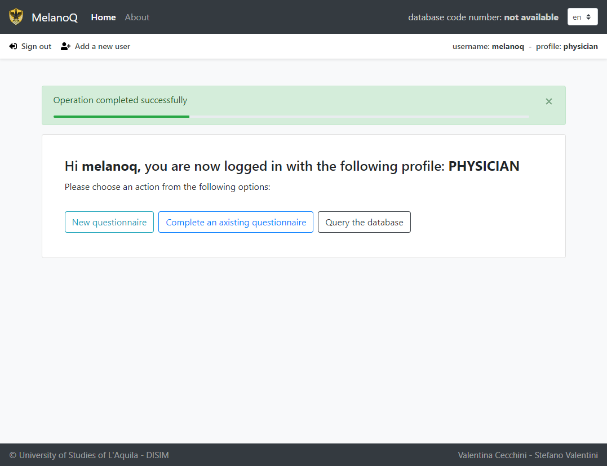
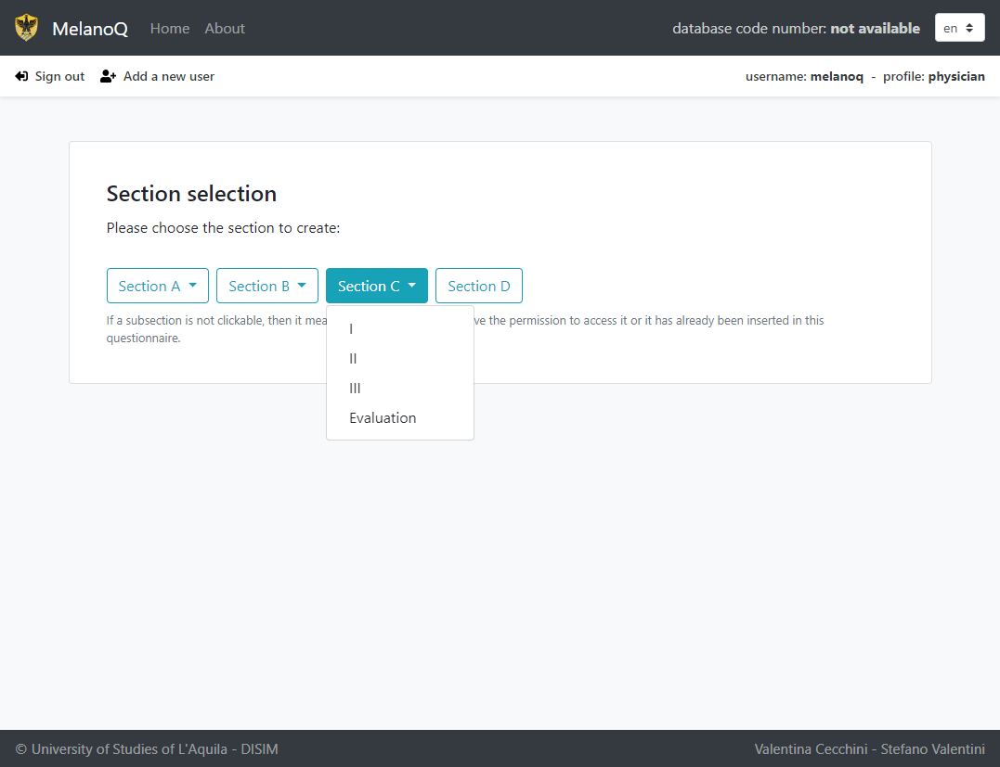
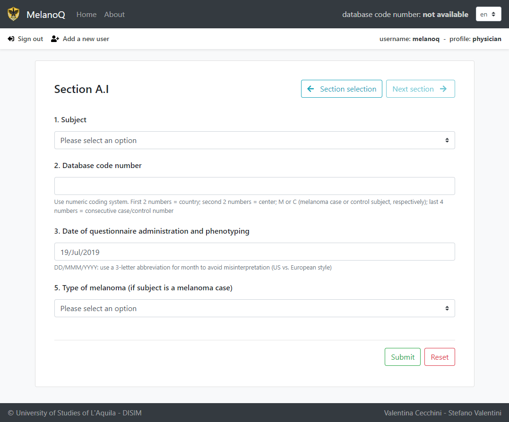
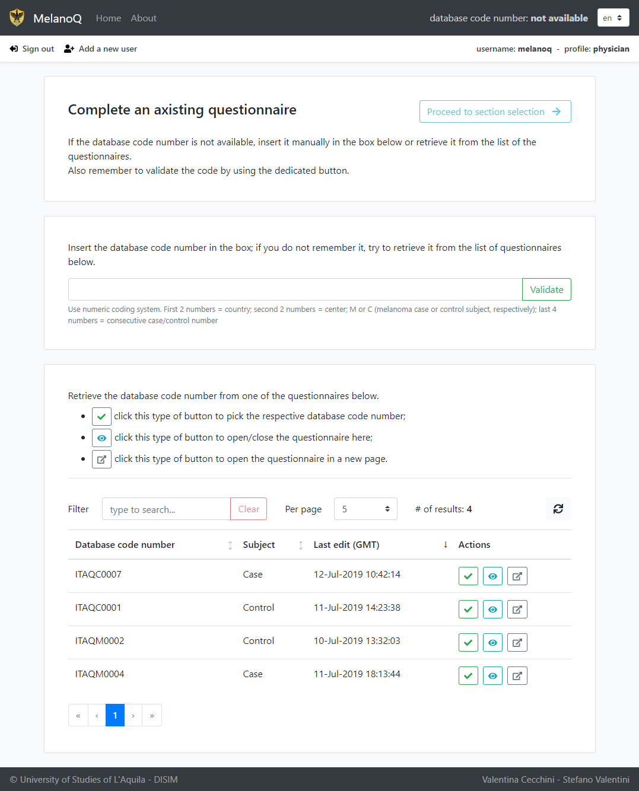
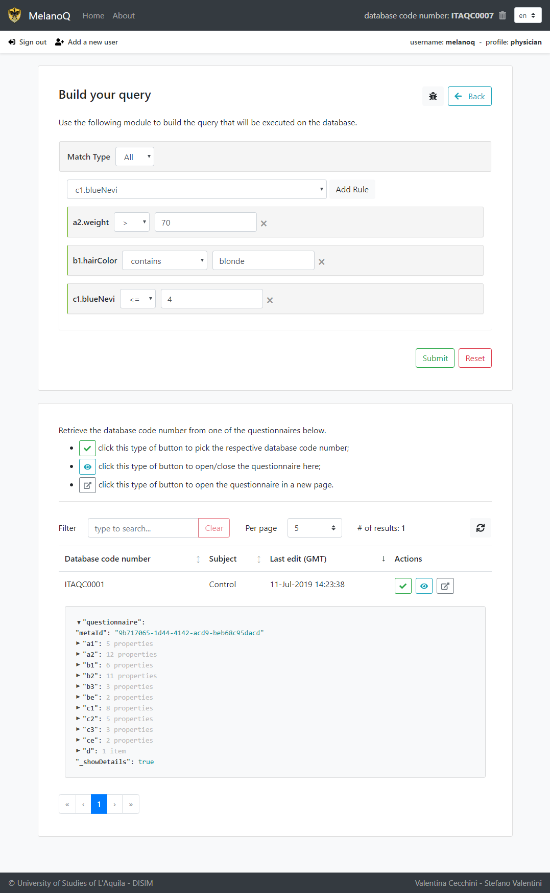
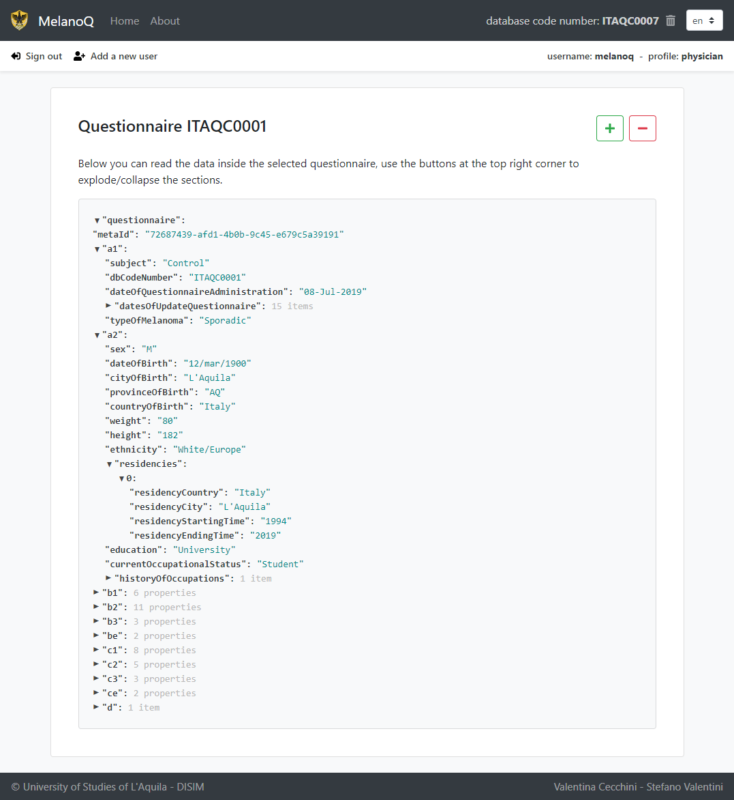

# Table of Contents
1. [Introduction](#ntroduction)
   
2. [Adopted technologies](#adopted-technologies)  
    2.1. [Database](#adopted-technologies-database)  
    2.2. [REST Server](#adopted-technologies-rest-server)  
    2.3. [Web Client](#adopted-technologies-web-client)  

3. [Data Model](#data-model)
   
4. [REST Server](#rest-server)  
    4.1. [Structure](#rest-server-structure)  
    4.2. [REST Endpoints](#rest-server-endpoints)  

5. [Web Client](#web-client)  
    5.1. [Views](#web-client-views)  
        5.1.1 [Home](#web-client-views-home)  
        5.1.2 [Section submission](#web-client-views-section-submission)  
        5.1.3 [Query builder](#web-client-views-query-builder) 

6. [Deployment](#deployment)  
    6.1 [Requirements](#deployment-requirements)  
    6.2 [Database](#deployment-database")  
    6.3 [REST Server](#deployment-rest-server)  
    6.4 [Web Client](#deployment-web-client)  

    


<div style="page-break-after: always;"></div>


[//]: # (================================= INTRODUCTION ================================================)


# Introduction <a name="introduction"></a>

Many melanoma observational studies have been carried out across different countries and geographic
areas using heterogeneous assessments of epidemiologic risk factors and clinical variables.  
The aim is to develop a consensus questionnaire to standardize epidemiologic and clinical data collection for melanoma risk
assessment.  
[Melanoq](https://www.ncbi.nlm.nih.gov/pubmed/30098061) is the product of the work of the MelanoStrum Consortium.

This project's goal is to implement a digital version of the aforementioned questionnaire by providing a way to *compile* the questionnaire itself and to expose the physicians, researchers and authorized personnel a way to *query* the data stored in the questionnaires' database.


<div style="page-break-after: always;"></div>


[//]: # (================================= ADOPTED TECHNOLOGIES ================================================)


# Adopted technologies <a name="adopted-technologies"></a>

To offer the best decoupling and deployment flexibility we decided to follow the classic **MVC** web-application architectural pattern by developing a **REST Server** and a **Web Client**, while storing the data on a **NoSQL documental database**.   
The excution flow follows the MVC paradigm: the data stored in the database is presented to the Web Client, from it it is possible to invoke functions on the REST Server that will then modify the aforementioned data, updating the Web Client view.


The reasons by which we decided to adopt a certain kind of tool or technology is explained in the following paragraphs.

## Database <a name="adopted-technologies-database"></a>

**CouchBase Server NoSQL database:** since the project aims to store a large and complex questionnaire for each patient adhering to the supervision programme of the melanoma cancer, we tried to find a database that was able to store a large amount of data whithout significantly changing the structure of the questionnaire itself. Couchbase is a documental NoSQL database whose datastructure is not composed by columns and rows as in the relational one, but documents are stored in the database in <code>.json</code> format, that is a simple, lightweight notation, compact and human readable. In Couchbase, a document usually represents a single instance of an object in the application code and each document can contain nested structures (sub-documents). This allows developers to naturally express many-to-many relationships without requiring a "reference table" or "junction table". So in this database we can store the entire questionnaire and all its sub-sections in an easy way and as naturally as possible. Morevover, the nested structure comes in handy when a certain degree of kinship is sought.  
Morover, Couchbase offers the possibility distribute the storage: because of Couchbase’s architecture, an application can be developed at small scale, but also deployed to a distributed cluster, or separate clusters of varied topologies, without any architecture or behavioral changes to that application. This feature seemed to us to be very advantageous for a future distributed deployment of the application, as it emerged from the given documentation, this study was carried out in collaboration between three countries: Italy, Greece and Spain with the possibility of extension to other countries. In addition, each country has a network of centres where the collection of questionnaires is made, which could in turn be distributed in the country.  
The last feature that made us decide to adopt this technology is its query lenguage: <code>N1QL</code> (pronounced “*nickel*”) is Couchbase’s next-generation query language. <code>N1QL</code> aims to meet the query needs of distributed document-oriented databases. It is very similar to <code>SQL</code>. <code>N1QL</code> gives application developers an expressive, powerful, and complete declarative language with industry standard ANSI joins for querying, transforming, and manipulating <code>.json</code> data – just like <code>SQL</code>.

<div style="page-break-after: always;"></div>

## REST Server <a name="adopted-technologies-rest-server"></a>

**Spring**: it is the standard-de-facto Java framework for what concerns the development of applications based on the MVC architectural pattern; it also comes with a generous amount of plugins that allow to easly connect to several types of database, deploy security filters, etc.  
The following are the components that have been exploited:


  - **Spring Boot**: Spring Boot makes it easy to create stand-alone, production-grade Spring based Applications that you can "just run". It directly embeds the principal web servers without need to deploy WAR files, provides opinionated 'starter' dependencies to simplify the build configuration, configure Spring and 3rd party libraries whenever possible in automatic way and it needs no code generation and no requirement for XML configuration.


  - **Spring Data JPA for CouchBase:** Spring Data for Couchbase is part of the umbrella Spring Data project which aims to provide a familiar and consistent Spring-based programming model for new datastores while retaining store-specific features and capabilities. The Spring Data Couchbase project provides integration with the Couchbase Server database. Key functional areas of Spring Data Couchbase are a POJO centric model for interacting with Couchbase Buckets and easily writing a Repository style data access layer. It has been choosed to use this framework because of the  many features provided (configuration support using Java based *Configuration* classes or an XML namespace for the Couchbase driver, *CouchbaseTemplate* helper class that increases productivity performing common Couchbase operations, annotation based mapping metadata but extensible to support other metadata formats, automatic implementation of *Repository* interfaces including support for custom finder methods... ) and because already known and used before by the components of the group.


  - **Spring Security and Json Web Token-based authentication**: Spring Security is a powerful and highly customizable authentication and access-control framework. It is a framework that focuses on providing both authentication and authorization to Java applications. The real power of Spring Security is found in how easily it can be extended to meet custom requirements.  
  JSON Web Token (JWT) is an open standard (RFC 7519) that defines a compact and self-contained way for securely transmitting information between parties as a JSON object.  Once the user is logged in, each subsequent request will include the JWT, allowing the user to access routes, services, and resources that are permitted with that token. Single Sign On is a feature that widely uses JWT nowadays, because of its small overhead and its ability to be easily used across different domains

## Web Client <a name="adopted-technologies-web-client"></a>


**VueJS**: it is yet another Javascript framework that recently exploded in popularity; it is a progressive framework for building user interfaces. Unlike other monolithic frameworks, Vue is designed from the ground up to be incrementally adoptable. The core library is focused on the view layer only, and is easy to pick up and integrate with other libraries or existing projects. On the other hand, Vue is also perfectly capable of powering sophisticated Single-Page Applications when used in combination with modern tooling and supporting libraries.  
In a nutshell: Vue allows to bind the <code>.html</code> view to the data model, and to interactively modify the second by interacting with the first. Obviously, as explained in the following sections, Vue actually offers way more powerfull tools, such as a routing engine, local store, etc.


<div style="page-break-after: always;"></div>


[//]: # (================================= DATA MODEL ================================================)

# Data Model <a name="data-model"></a>

The structure of how each questionnaire is stored is the following <code>.json</code> format:

```json
{
    ...

    "a2": {
        "education": "text",
        "ethnicity": "text",
        "currentOccupationalStatus": "text",
        "sex": "text",
        "weight": "numeric",
        "historyOfOccupations": {
            "occupationStartingTime": "text",
            "occupationEndingTime": "text"
        },
        "provinceOfBirth": "text",
        "countryOfBirth": "text",
        "residencies": {
            "residencyEndingTime": "text",
            "residencyStartingTime": "text",
            "residencyCountry": "text",
            "residencyCity": "text"
        },
        "height": "numeric"
    },
    ...
}
```
We tried to build a 1 to 1 mapping between the data model and the given questionnaire representation:   
- the entire questionnaire is between the curly brackets;  
- inside, each questionnaire has a certain number of "childrens" that match to the sections of the original questionnaire representation; 
- each child is identified by a string representig the name of the respective section (so section A1 is identified by <code>a1</code>, section A2 is identified by <code>a2</code> and so on.); 
- each section has a certain number of fields, where the left side is the identifier of the field that is in the given questionnaire model and the right side is the value that contains the answer to that specific field. We can have different type of values:  
   - <code>text</code> (see for example <code>a2.education</code>), 
   - <code>numeric</code> (see for example <code>a2.weight</code>) 
   - lists that we represent as child components (see for example <code>a2.residencies</code>).

To access a particular field it is simply needed to follow the key hierarchy; e.g., to access the field <code>occupationStartingTime</code> of the section <code>a2</code>, we need to type <code>a2.historyOfOccupations.occupationStartingTime</code>.


<div style="page-break-after: always;"></div>


[//]: # (================================= REST SERVER ================================================)


# REST Server <a name="rest-server"></a>

## Structure <a name="rest-server-structure"></a>

The server side of our project is structured with the following packages: <code>model</code>, <code>controller</code>, <code>repository</code> and <code>service</code>.  
In the <code>model</code> package there is the "description" of the entities used by the application:
- <code>User</code> that is the representation of  user's types that can log in in the application and add the questionnaires or consult them.
- <code>Questionnaire</code> where is explained of which sections a questionnaire is composed. 
- <code>Query</code> is the model of how the application can be questioned.
- <code>ErrorMessage</code> is the structure that will have any error message in the application.
- <code>section</code> subpackage contains all the models of the all sections of which a questionnaire is composed by (i.e., section A1, A2, B1, B2, B3, C1, C2, C3, D and Evaluation).
- <code>nested</code> subpackage contains all the complex objects nested in the various section.

The <code>controller</code> orchestrates the data flow of the entire application:
- Trough <code>QuestionnaireController</code> and <code>UserController</code> we indicate the CRUD operations to perform on data in the database.
- <code>Response</code> defines the format of how a general response from the server to the client must be.
- <code>JwtAuthenticationController</code> is the controller that manage the authentication of the users in the application.
- <code>ExceptionControllerAdvice</code> deals with the management of the exceptions throw, eventually, by the functioning of the application.
  
The <code>repository</code> package contains all the interfaces needed to communicate with the database, these interfaces will be automatically implemented by the Spring Data JPA module.

The <code>service</code> package contains the business logic of the application: it contains all the sections' services and the user service, where are specified the CRUD operation to perform on the database and the server internal logic.

In addition to the packeges characterising the functionnalities of the application, there are:
- the <code>configuration</code> package whose contains all the classes necessarely to configure the application to the use of the additional modules;
- the <code>BusinessException</code> class that handles the exeptions of the application;
- the <code>Application</code> class that is the starting point of the entire application.


<div style="page-break-after: always;"></div>


## REST Endpoints <a name="rest-server-endpoints"></a>


- GET <code>/questionnaire/{dbCodeNumber}</code>:  
    retrives the questionnaire identified by <code>dbCodeNumber</code>.

- POST <code>/questionnaire/query</code>:  
    retrives all the questionnaires in the database according to the filters setted in the query. 

- GET <code>/questionnaire</code>:    
    retrives all the questionnaires.

- GET <code>/questionnaire/validate/{dbCodeNumber}</code>:  
    verifies if the given <code>dbCodeNumbe</code> exists or not.

- POST <code>/questionnaire/{dbCodeNumber}/{section}</code>:  
    inserts the section indicated in the <code>section</code> parameter to he questionnaire indentified by the <code>dbCodeNumber</code>.

- GET <code>/questionnaire/{dbCodeNumber}/{section}</code>:  
    returns the section indicated in the <code>section</code> parameter of the questionnaire indentified by the <code>dbCodeNumber</code>.

- PATCH <code>/questionnaire/{dbCodeNumber}/{section}</code>:  
    updates the section indicated in the <code>section</code> parameter to he questionnaire indentified by the <code>dbCodeNumber</code>.

- DELETE <code>/questionnaire/{dbCodeNumber}/{section}</code>:  
    deletes the section indicated in the <code>section</code> parameter to he questionnaire indentified by the <code>dbCodeNumber</code>.

- POST <code>/user</code>:  
    inserts an user in the database.

- GET <code>/user/{username}</code>:  
    returns the user whose username matches with the given <code>username</code>.

-  POST <code>/authentication</code>:  
    performs the authentication of a user and assigns it a token.


<div style="page-break-after: always;"></div>


[//]: # (================================= WEB CLIENT ================================================)

# Web Client <a name="web-client"></a>

The **web client** has been implemented using the [VueJS](https://vuejs.org/) framework.  
The internal project structure is as follows:
- **assets**: contains the static resources, such has the stylesheets, images, etc.
- **common**: contains the services that are accessed by rest of the application, including the api services for the connection to the api server,  the locale serviec that allows to switch between the various languages, the authentication service that is used to store the token and the logged user's data on the browser's local storage (so to survive to page refreshes and between sessions), etc.
- **components**: here are contained the components used by VueJS to build the various views, these components can be either used as singletons (i.e., they appear at most one time in a given view, these components are prefixed by the `The` keyword, such as the Header component), or classic components that can be used as many times as required in a given view (such as the Message component)).
- **locales**: contains the `.json` files that store the translation data (the key of an entry of these files points to a word/phrase to be translated, the value of that key contain the respective translation).
- **plugins**: here are located the VueJS plugins (*datepicker*, *bootstrap*, *vuelidate*, etc.).
- **router**: since VueJS implements the *single page web application* design pattern, there is the need to have a structured way to navigate between the views, this is achieved by the *router* plugin, this directory contains its configuration: a series of paths pointing to the respective view files.
- **store**: to survive between views data needs to be stored in some way, this directory contains the services that are responsible of implementing the VueJS *vuex* store interface. In these files there is a *model* description of the data, several *action* methods and several *mutation* methods; *actions* expose asynchronous entry points to *mutation*, *mutation* modify the data contained in the model (the cycle is the following: a component invokes an *action*, the *action* triggers a *mutation*, the *mutation* modifies the *model* data, the component sees the modified data; all of this while the component is free to perform other actions, since the call to the action is asynchronous).
- **views**: this directory contains the VueJS views; a *view* is a collection of components plus some stand-alone template code, the template is followed by the logic of the view (what happens when the user presses a certain button, etc.).
- **App.js**: is the entry point of the application and the first view.
- **main.js**: is the glue that connects al the various components, views, plugins, etc.

<div style="page-break-after: always;"></div>

## Views <a name="web-client-views"></a>
*All the screenshots that are showed here can be found inside the <code>/docs/views/</code> directory.*

### Home <a name="web-client-views-home"></a>
This is the view that is presented to the user at the first access: here the system prompts the user to log in to access the functionnalities.
The user can log in with its credientals using three different *profiles*, the credentials are the same but the choosen profile will influnce the functionnality to which the user can access during its session: if a physician needs to have a patient (maybe a control one) to fill a questionnaire section then it can log in with its physician credentials but with the *control* profile.

After having logged in, a series of actions become available, based on the choosen profile (case/control profiles cannot access to the query engine and database code number retival).

|    Home view as guest     |  Home view: log in   |
| :-----------------------: | :------------------: |
|  |  |


<div style="page-break-after: always;"></div>


|    Home view as logged user     |
| :-----------------------: |
|  |
 

<div style="page-break-after: always;"></div>


### Section submission <a name="web-client-views-section-submission"></a>
Based on which section has already been inserted and on which profile the user is currently logged in a series of section will be available.

After having choosen a section, the user will be redirected to the respective form (if, for any reason, a user with an invalid profile reaches a restricted access form section, it is automatically redirected to the home page with an error message).  
Each form section has a validator function for each field, so to avoid the insertion of invalid data.  
Once the form has been submitted the user can follow the top-right corner arrow to reach the next section to fill, if authorized.

|        Section selection         |    Section form example     |
| :------------------------------: | :-------------------------: |
|  |  |

To access a section sumbission form it is needed that the questionnaire database code number of the questionnaire that the user is trying to fill is stored in the session (with an exception for the section A1, that is the one that creates the database code number); this can happen in two ways:
- either the subsequent forms are submitted in the same session as the section A1 (the database code number is stored after having submitted a new A1 section)
- or the user has to either manually write the database code number or it can choose it from the list of the questionnaires whose section A1 has already been submitted.
 

<div style="page-break-after: always;"></div>


|         Database code number retival         | 
| :------------------------------------------: | 
|  |


<div style="page-break-after: always;"></div>


### Query builder <a name="web-client-views-query-builder"></a>

After having successfully logged in with the physician profile, it is possible to access the query builder view: here the user can create its query by composing a series of *rules*; all the added rules can be considered as *any of them must be valid* or *all of them must be valid*. It is possible to add one or more rules for each one of the fields of the questionnaire.

The following operators are available for the **textual** fields (all *case insensitive*):
- <code>contains</code>: *true* if the field contains the submitted value inside it
- <code>does not contain</code>: when *contains* is not *true*
- <code>equals</code>: *true* when the submitted value is *exactly* the same as the value contained in the field
- <code>does not equal</code>: when *equals* is not *true*

The following operators are available for the **numeric** fields:
- **<code>=</code>** (equals)
- **<code><></code>** (does not equal)
- **<code>></code>** (greather than)
- **<code>>=</code>** (greather or equal than)
- **<code><</code>** (lesser than)
- **<code><=</code>** (lesser or equal than)

Once the query has been submitted it is possible to see the results in the table at the bottom of the page. It is also possible to see the resulting questionnaires direcly in the same page as the query builder or to open them in a new page.


<div style="page-break-after: always;"></div>


|      Query builder and local view       |               Standalone view                |
| :-------------------------------------: | :------------------------------------------: |
|  |  |


<div style="page-break-after: always;"></div>


[//]: # (================================= DEPLOYMENT ================================================)


# Deployment <a name="deployment"></a>

## Requirements <a name="deployment-requirements"></a>
- CouchBase Server - [https://www.couchbase.com/](https://www.couchbase.com/)
- Apache Tomcat - [http://tomcat.apache.org/](http://tomcat.apache.org/)
- Apache Maven - [https://maven.apache.org/](https://maven.apache.org/)
- Yarn - [https://yarnpkg.com/en/](https://yarnpkg.com/en/) &nbsp;or&nbsp; NPM (Node Package Manager) - [https://www.npmjs.com/](https://www.npmjs.com/)
- VueJS CLI - [https://cli.vuejs.org/](https://cli.vuejs.org/)


## Database <a name="deployment-database"></a>

Download and install CouchBase Server Community or Enterprise from here: [https://www.couchbase.com/downloads](https://www.couchbase.com/downloads).

After having installed and run it, its web interface will be available at the address [http://machine-ip:8091](http://machine-ip:8091), configure the server according to your preferences and then create a user and a bucket (remember that the bucket name and the user's credentials must then be provided to the MelanoQ api server), finally add all the permissions to the created user for the created bucket.

Go to the <code>Query</code> section of the web interface and run:
```sql
CREATE PRIMARY INDEX ON bucketname USING VIEW;
```
where <code>bucketname</code> is the name of the created bucket.

Now the database is empty, so you need to manually add an admin user for the MelanoQ api server: 
- generate a <code>bcrypt</code> password from this online tool: [https://www.browserling.com/tools/bcrypt](https://www.browserling.com/tools/bcrypt) using *12 rounds* (be sure to check that the generated encrypted password starts with the <code>$2a</code> prefix)
- execute the following query:  
   ```sql
   INSERT INTO bucketname (KEY, VALUE) 
    VALUES 
    (
       "k999", 
       {
           "role": "admin", 
           "username": "name", 
           "password": "generated-password", 
           "_class": "it.univaq.disim.bioinformatics.melanoq.model.User"
        }
    )
    ```

   where <code>k999</code> is any random alphanumeric string, <code>name</code> is a name of your choice and <code>generated-password</code> is the bcrypt password you previously generated.


If you need to backup the database content run: 
```console
> cbbackup http://machine-ip:8091 path-to-dest-folder -u username -p password -b bucket-name
```
if you need to restore a backup run: 
```console
> cbrestore path-to-source-folder http://machine-ip:8091 -u username -p password -b bucket-name -x rehash=1
```

where <code>cbbackup</code> and <code>cbrestore</code> are tools that are located in the installation directory of CouchBase Server.


## REST Server <a name="deployment-rest-server"></a>

```sh
> git clone https://gitlab.com/valent0ne/melanoq.git 
> cd ./melanoq/code/api 
> mvn clean package
```


Now inside the directory <code>./melanoq/code/api/target/</code> there will be a file named <code>melanoq-x.y.z.jar</code>, move this file inside your *Apache Tomcat* <code>webapp</code> directory.  
The MelanoQ api server will be available at the address [http://machine-ip:8080/melanoq/api](http://machine-ip:8080/melanoq/api). To change the application parameters (e.g., couchbase server credentials and address), before executing the command <code> mvn clean package</code> edit the file <code>application.properties</code> located in the directory <code>./melanoq/code/api/src/main/resources</code>.


## Web Client <a name="deployment-web-client"></a>

```console
> git clone https://gitlab.com/valent0ne/melanoq.git
> cd ./melanoq/code/webclient
> yarn
> yarn build
```

or (if you are using <code>npm</code> instead of <code>yarn</code>):

```console
> git clone https://gitlab.com/valent0ne/melanoq.git
> cd ./melanoq/code/webclient
> npm
> npm run build
```


Before executing the <code>build</code> command, remember to edit the <code>config.js</code> file inside the directory <code>./melanoq/code/webclient/src/common</code> with the correct ip address of the MelanoQ api server.


Now you have two options:
- double-click <code>index.html</code> inside the directory <code>./melanoq/code/webclient/dist</code> to directly access the local instance of the client
- deploy the client (copy the content of the directory <code>./melanoq/code/webclient/dist</code>) into an http server (Apache Tomcat or others) to expose the client to the public.

